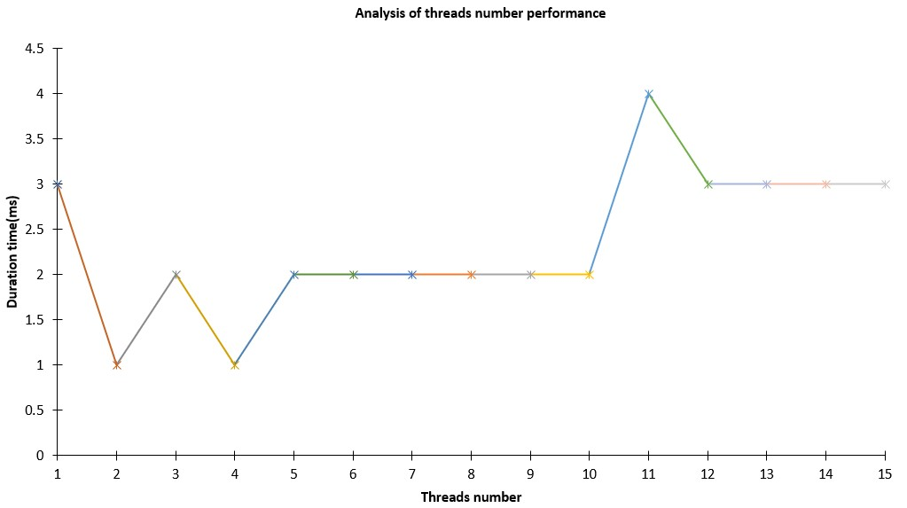
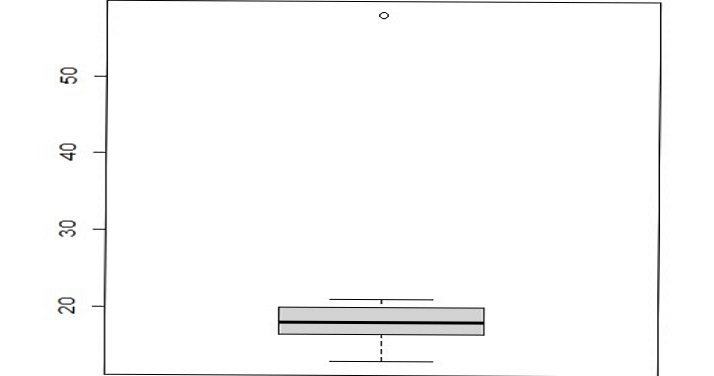

# Lab4-Conclusions

## Description

## Hardware

CPU: R7-4800h 8 cores 16 threads(logical cores)

memory: 16 G

disk: SSD 512G * 2

### purpose

Our purpose is to get 5 longest and 5 shortest `log.data` in `logs` table by using thread pool to realize mapreducing.

### the task for each thread

The array of logs is divided among the threads and each of them has a task to find 5 longest/shortest `log.data`. After that their results are merged into one, and reduced.

## Code part - Requirement 1~3

In order to fulfil this task, we created service for **management** _(users in the system that are at least moderator in global permissions)_ and accordingly a controller _(following the MVC pattern)_. We also included integration and unit tests to verify whether the functionalities are working as intended. All of the incoming data is validated using class validators, so no malicious input can go through.

1. In the `ManagementController.java`, we are handling two endpoints:

    1. `GET /analysis-longest-five/{numThreads}` and `GET /analysis-shortest-five/{numThreads}` To get the list of results object, which have following fields:
        - `count`: 5
        - `data`: the longest/shortest 5 `log.data` in `logs` table
        - `meta`: Start time, end time and the overall duration of the task
        - It is also for **Requirement 1.2 - show the execution time to the user**
    2. `POST /report` To generate an excel file with results and necessary graphs
        - request body is
            - the number of threads
            - the number of iterations (calculate the average time for each number of threads)
        - excel file will have
            - the duration of each task starts from 1 thread to `numThreads` threads.
            - the figure of the results.
            - sheet1 for the longest 5 `log.data` in `logs` table
            - sheet2 for the shortest 5 `log.data` in `logs` table

2. Create multi-threads and **Requirement 1.2 - the code for monitoring the execution time**

    We optimize the threads-using from create threads to use **thread pool**.

    1. Create thread pool

        The pool size here is 40 which is obviously bad, but it is used for testing the performance of how the multi-threads work.

        **Actually Our projects should be considered as CPU-intensive which means it should calculate as:**

        > N threads = N cores + 1

    ```java
    /**
      * The poolSize attribute is used to set the number of threads to use.
      */
    private final int poolSize = 40;

    /**
      * The executor attribute is used to create a thread pool.
      */
    private final ExecutorService executor = Executors.newFixedThreadPool(poolSize);
    ```

    2. In the `ManagementService.java` file, the service has the methods `longestFiveLogs` and `shortestFiveLogs` which will use the thread pool **execute tasks**. In the methods also create a `CountDownLatch` to wait for all the threads to finish their tasks.

    ```java
    /* Requirement 4.1.2 */
    CountDownLatch latch = new CountDownLatch(numThreads);
    long start = System.currentTimeMillis();
    for (int i = 0; i < numThreads; i++) {
      int finalI = i;
      List<List<Log>> finalSubLogs = subLogs;
      executor.execute(() -> subShortestFiveLogs(finalSubLogs.get(finalI), pqLogs, resultNum, latch));
    }
    latch.await();
    long end = System.currentTimeMillis();
    long duration = end - start;
    /* Requirement 4.1.2 */
    response.setMeta(
        new HashMap<String, Object>() {
          {
            put("startTime", start);
            put("duration", duration);
            put("endTime", end);
          }
        });

    List<Log> result = new ArrayList<>();
    // this loop is to add the element from the priority queue to the result list
    // if use pqLogs.toArray(), the order of the elements in the array is not
    // guaranteed
    while (!pqLogs.isEmpty()) {
      result.add(pqLogs.poll());
    }
    response.setData(Arrays.asList(result.toArray()));
    ```

    3. In methods of subtasks, we use `latch.countDown()` to count down the number of threads that have finished their tasks.

3. **Requirement 2 - 2 critical sections with multithreads that access the same data (read/write)**

    In order to prevent such failures, we implemented a protection mechanism that looks as follows:

    **(Note: Codes below are in two different methods and `response` here are different objects)**

    ```java
    synchronized (response) {
      /* Requirement 4.1.1 */
      System.out.println(
          "Thread " +
              Thread.currentThread().getId() +
              " is trying to access the public asset - final PQ for 5 longest logs");
      while (!pq.isEmpty()) {
        response.add(pq.poll());
        if (response.size() > resultNum) {
          response.poll();
        }
      }
    }
    latch.countDown();
    ```

    ```java
    synchronized (response) {
      /* Requirement 4.1.1 */
      System.out.println(
          "Thread " +
              Thread.currentThread().getId() +
              " is trying to access the public asset - final PQ for 5 shortest logs");
      while (!pq.isEmpty()) {
        response.add(pq.poll());
        if (response.size() > resultNum) {
          response.poll();
        }
      }
    }
    latch.countDown();
    ```

4. **Requirement 3 - generate/load data**
    - In `LogController.java`, there is a specific endpoint `POST /generate-test-data` which can create test logs.
    - A python script was also created (`scripts/script.py`) in order to generate random users, websites using our SSO and logs. It's a very useful utility tool to perform load tests of the system, and performance tests. It makes use of `faker` library, so all of the data are very similar to the real-life scenario data.
    - Loading the data is done by `findAll` method in `LogRepository.java`.
5. **Requirement 1.1 - show proper message of tasks of the multi-threading**

    - `ManagementService.java #longestFiveLogs() #subLongestFiveLogs()`
    - `ManagementService.java #shortestFiveLogs() #subShortestFiveLogs()`

    ```java
    System.out.println("Thread " + Thread.currentThread().getId() + " is running for " + logs.size() + " logs");
     // ...
    System.out.println("Thread " + Thread.currentThread().getId() + " is trying to access a public asset - final PQ for 5 longest logs");
    ```

## Report part - Requirement 4~6
Our proposed approach involves utilizing a dataset comprising 3 million entries and performing multiple iterations to calculate the average execution time of each test. The purpose of this procedure is to evaluate the performance of our multi-threaded program.

Both the dataset and the resulting Excel report will be generated through HTTP requests. This ensures that the data is retrieved dynamically and reflects real-time conditions for accurate performance analysis.

### 1. Preliminary attempts

#### 1.1 Reason for 3 million data and average time of iteration

In statistics, these observations in preliminary attempts highlight the need for robust statistical techniques, such as increasing the sample size, eliminating outliers, and utilizing robust measures of central tendency, to ensure reliable and accurate analyses.

1. Number of data

   When we employed a dataset consisting of 10,000 logs, the generated figure is presented below:

<div align="center">

</div>
<div align="center">figure 1. Report of small number of data</div>
    It is evident that the execution time for processing the 10,000 logs is significantly minimal, rendering it challenging to obtain precise measurements. Furthermore, our current system is capable of accommodating up to 3 million data entries. However, surpassing this threshold, such as reaching 3.5 million, leads to the program freezing due to excessive CPU utilization, ultimately reaching 100%.

2. Average time of iteration

   As an illustrative example, we have included a report containing the results of a single iteration for 3 million data:

<div align="center">

</div>
<div align="center">figure 2. Report of only one iteration</div>
    
```r
> data <- c(54, 27, 25, 20, 21, 58, 17, 13, 17, 16, 20, 17, 14, 19, 20)
> sd_threshold <- 2
> mean_val <- mean(data)
> sd_val <- sd(data)
> outliers <- data[data > mean_val + sd_threshold * sd_val | data < mean_val - sd_threshold * sd_val]
> outliers: 
[1] 54 58
> var(data[4:15])
[1] 142
```

<div align="center">

</div>
<div align="center">figure 3. Boxplot for outlier of data with 1 iteration from number of threads 4 to 15</div>

Notably, from the outliers and variance from threads 4-12 which is 142, the execution time for a single iteration may exhibit outliers, implying the presence of anomalous values. In order to derive a more accurate estimation, it is imperative to conduct multiple iterations and calculate the average time.
    
(Note: the average variance of 3 times of 1 iteration test is 142.33 while, for the same number of threads range, the variance of 20 iteration is 64.76364)

#### 1.2 test for 3 million data, 20 iterations for 1-15 threads (= 15 \* 20 tests)

1. **count of logs:**

<div align="center">

</div>
<div align="center">figure 4. Count of logs</div>

2. **excel report:**
<div align="center">

</div>
<div align="center">
   figure 5. [Report for 3 millions data 1-15 threads](./Lab4/report15th.xlsx)
</div>


The graph in the report demonstrates a rapid decrease in task time as the number of threads increases from 1 to 5, followed by a slower decrease. 

However, it would be expected for the task time to increase when the number of threads becomes too high. To investigate this situation, additional tests were conducted with larger numbers of threads.

### 2. test for 3 million data, 200 iterations for 1-40 threads (= 40 \* 200 tests)

**excel report:**
<div align="center">

</div>
<div align="center">
    figure 6. [Report1 for 1-36 threads 20 iterations](./Lab4/report36th.xlsx)
</div>
<div align="center">

</div>
<div align="center">
    figure 7. [Report2 for 1-40 threads 200 iterations](./Lab4/report40th.xlsx)
</div>


### Conclusion:

Based on the presented figure and trendlines, it is evident that the task time experiences a rapid decline initially until the thread count reaches 6. Afterward, there is a gradual increase in task time when the thread count exceeds 16 according to the figure line, and around 25 according to the trendline.

Key Findings:

1. The task time decreases as the number of threads increases, but the rate of decrease diminishes as well.
2. Further increasing the number of threads may lead to an increase in the total task time due to the following factors:
   1. Limitations imposed by the **hardware**, particularly the CPU and memory, as mentioned at the beginning of the report.
   2. At a certain point, the **time** required to complete each task may surpass the time spent on thread handling.
   3. In Java's multithreading, the **locking mechanism** has evolved. Initially, the synchronized keyword employs biased locking. If multiple threads contend for the lock, it transitions to lightweight locking. However, if a task is computationally intensive or there are too many threads, and the spin count exceeds the limit, it escalates to heavyweight locking. In such cases, **heavyweight locks** utilize operating system mutexes as the underlying mechanism, resulting in frequent user-and-kernel mode switches that negatively impact performance.

#### Java multithreading

Multithreading in java makes use of physical cores and logical cores. In java, we create user-thread while JVM will manage to map our user-thread to kernel-thread which will be handled by Operating System.

We have 8 physical cores and 16 logical cores in the test used CPU. So we can totally have 16 kernel threads at most.

Java multithreading enables concurrent execution of multiple threads within a Java program. When multiple threads are utilized, they can execute tasks concurrently, potentially improving the overall performance and responsiveness of the application. We should consider the following concepts in the future:

1. Threads: In Java, a thread is a lightweight unit of execution that operates independently. Each thread follows its own execution path and performs a specific task.

2. Thread Synchronization: When multiple threads access shared resources or data concurrently, it can lead to race conditions and data inconsistency. Thread synchronization mechanisms, such as locks and semaphores, ensure that only one thread can access a shared resource at a given time, preventing conflicts and maintaining data integrity.

3. Context Switching: Context switching is the process of switching between different threads in a multitasking environment. The operating system handles context switching by saving and restoring the state of each thread, allowing multiple threads to share the CPU resources effectively.

4. Thread Safety: Thread safety refers to the ability of a program or data structure to function correctly and consistently in a multithreaded environment. Thread-safe code ensures that concurrent access to shared resources does not lead to unexpected behavior or data corruption.

5. CPU and Memory Constraints: Multithreading can improve performance, but there are limitations. The CPU has a finite number of cores, and excessive thread creation may lead to resource contention, increased context switching overhead, and reduced performance. Additionally, memory usage increases as each thread requires its own stack and resources.

6. Locking Mechanisms: Java provides various locking mechanisms to manage thread synchronization. The synchronized keyword allows exclusive access to a block of code or an object, preventing multiple threads from executing it simultaneously. However, as mentioned earlier, the locking mechanism evolves from biased locking to lightweight locking and heavyweight locking, depending on contention and system conditions.
