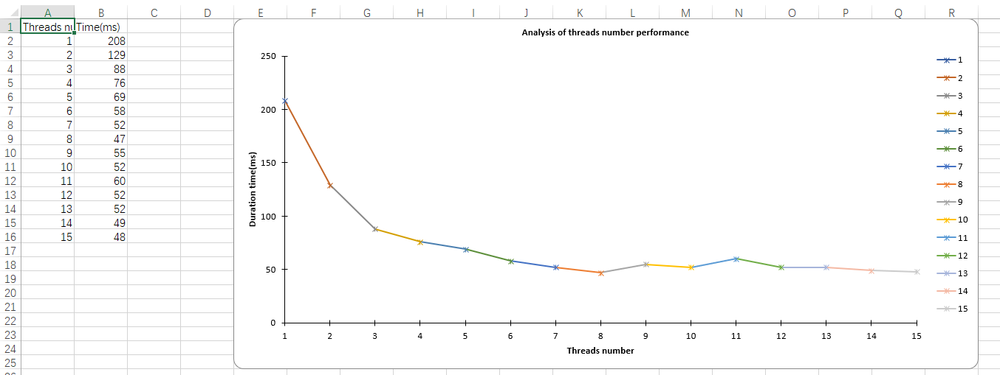
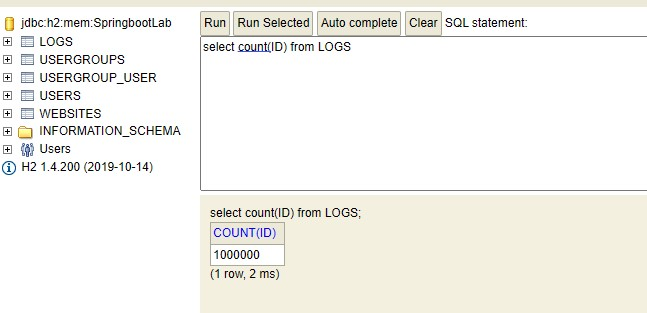
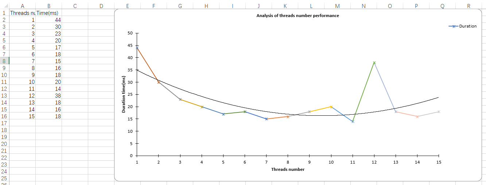
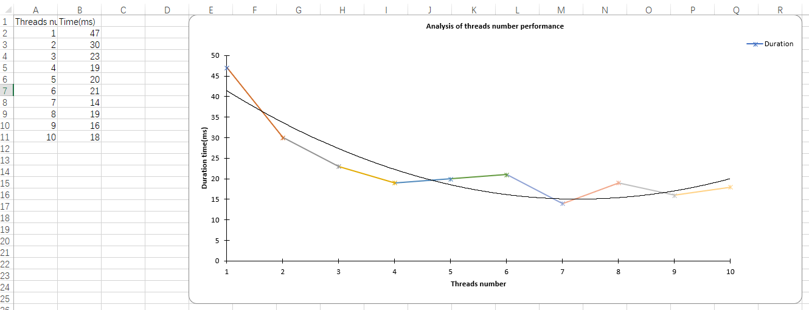

# Lab4-Conclusions

## Description

### purpose

Our purpose is to get 5 longest `log.data` in `logs` table.

### the task for each thread

The array of logs is divided among the threads and each of them has a task to find 5 longest `log.data`. After that their results are merged into one, and reduced.

## Code part - Requirement 1~3

In order to fulfil this task, we created service for **management** _(users in the system that are at least moderator in global permissions)_ and accordingly a controller _(following the MVC pattern)_. We also included integration and unit tests to verify whether the functionalities are working as intended. All of the incoming data is validated using class validators, so no malicious input can go through.

In the `ManagementController.java`, we are handling two endpoints::

1. `GET /analysis-longest-five/{numThreads}` To get the list of results object, which have following fields:
    - `count`: 5
    - `data`: the longest 5 `log.data` in `logs` table
    - `meta`: Start time, end time and the overall duration of the task
    - It is also for **requirement 1.2 - show the execution time to the user**
2. `POST /report` To generate an excel file with results and necessary graphs
    - request body is the number of threads
    - excel file will have
        - the duration of each task starts from 1 thread to `numThreads` threads.
        - the figure of the results.
3. Create multi-threads and **Requirement 1.2 - the code for monitoring the execution time**

    In the `ManagementService.java` file, the service has a method `longestFiveLogs` which will create and handle the threads needed for the task.

    ```java
    List<Thread> threads = new ArrayList<>();
    PriorityQueue<Log> pqLogs = new PriorityQueue<>(resultNum + 1, (a, b) -> a.getData().length() - b.getData().length());
    long start = System.currentTimeMillis();
    for (int i = 0; i < numThreads; i++) {
         int finalI = i;
         Thread thread = new Thread(() -> subLongestFiveLogs(subLogs.get(finalI), pqLogs, resultNum));
         thread.start();
         threads.add(thread);
    }
    for (Thread thread : threads) {
         thread.join();
    }
    long end = System.currentTimeMillis();
    long duration = end-start;
    response.setMeta(new HashMap<String, Object>(){{
         put("startTime", start);
         put("duration", duration);
         put("endTime", end);
    }});
    List<Log> result = new ArrayList<>();
    // this loop is to add the element from the priority queue to the result list
    // if use pqLogs.toArray(), the order of the elements in the array is not guaranteed
    while (!pqLogs.isEmpty()) {
         result.add(pqLogs.poll());
    }
    response.setData(Arrays.asList(result.toArray()));
    ```

4. **Requirement 2 - multiple threads want to access the same data (read/write)**

    in order to prevent such failures, we implemented a protection mechanism that looks as follows:

    ```java
    synchronized (response){
       while (!pq.isEmpty()) {
          response.add(pq.poll());
          if(response.size() > resultNum){
             response.poll();
          }
       }
    }
    ```

5. **Requirement 3 - generate/load data**
    - In `LogController.java`, there is a specific endpoint `POST /generate-test-data` which can create test logs.
    - A python script was also created (`scripts/script.py`) in order to generate random users, websites using our SSO and logs. It's a very useful utility tool to perform load tests of the system, and performance tests. It makes use of `faker` library, so all of the data are very similar to the real-life scenario data.
    - Loading the data is done by `findAll` method in `LogRepository.java`.
6. **Requirement 1.1 - show proper message of tasks of the multi-threading**

    `ManagementService.java #longestFiveLogs()`

    ```java
    System.out.println("Thread " + Thread.currentThread().getId() + " is running for " + logs.size() + " logs");
     // ...
    System.out.println("Thread " + Thread.currentThread().getId() + " is try to access the public asset - final PQ for 5 longest logs");
    ```

## Report part - Requirement 4~6

### 1. test for 3 million data

1. count of logs:

    

2. request of auth to get jwt token of admin account:

    

3. request of get excel report:

    

4. excel report:

    [report for 3 millions data](./Lab4/report3m.xlsx)
    

5. Conclusion:

    - As the number of threads increases, the time of task decreases. However, the marginal effect is also decreasing.
    - If we would not limit the number of threads to 15, the time with the number of threads used, would probably increase due to the following reasons:
        1. The limitation of hardware. (CPU, memory, etc.)
        2. The time of finishing each task at some point won't be longer than the time of handling a thread.
        3. The locking mechanism in Java's multithreading has undergone upgrades. When using the synchronized keyword, it starts with biased locking. If multiple threads contend for the lock, it transitions to lightweight locking. However, if a task is computationally heavy or there are too many threads, and the spin count exceeds the limit, it escalates to heavyweight locking. In this case, the heavyweight lock utilizes operating system mutexes as the underlying mechanism, resulting in frequent user-and-kernel mode switches, which negatively impact performance.

**So we create other tests for different number of data.**

### 2. test for 1 million data

1. count of logs:

    

2. excel report:
    - [report1 for 1 million data](./Lab4/report1m.xlsx)
    - [report2 for 1 million data](./Lab4/report1m2.xlsx)
    - 
    - 
3. Conclusion:

    As the trendlines show above, the time of task is going down quickly at the beginning, and increasing slowly after we use too many threads.

# Java multithreading

Multithreading in java makes use of logical cores and physical cores.

The host machine has 8 physical cores and 16 logical cores.
