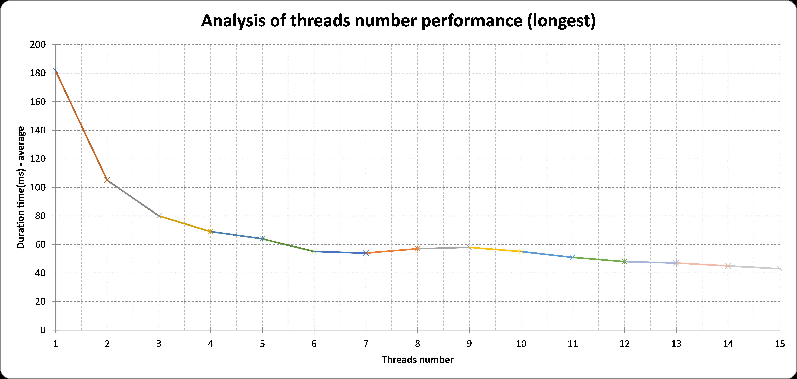

# Lab4-Conclusions

## Description

## Hardware

CPU: R7-4800h 8 cores 16 threads(logical cores)

memory: 16 G

disk: SSD 512G \* 2


### purpose

Our purpose is to get 5 longest and 5 shortest `log.data` in `logs` table by using thread pool to realize mapreducing.

### the task for each thread

The array of logs is divided among the threads and each of them has a task to find 5 longest/shortest `log.data`. After that their results are merged into one, and reduced.

## Code part - Requirement 1~3

In order to fulfil this task, we created service for **management** _(users in the system that are at least moderator in global permissions)_ and accordingly a controller _(following the MVC pattern)_. We also included integration and unit tests to verify whether the functionalities are working as intended. All of the incoming data is validated using class validators, so no malicious input can go through.

1. In the `ManagementController.java`, we are handling two endpoints:

    1. `GET /analysis-longest-five/{numThreads}` and `GET /analysis-shortest-five/{numThreads}` To get the list of results object, which have following fields:
        - `count`: 5
        - `data`: the longest/shortest 5 `log.data` in `logs` table
        - `meta`: Start time, end time and the overall duration of the task
        - It is also for **Requirement 1.2 - show the execution time to the user**
    2. `POST /report` To generate an excel file with results and necessary graphs
        - request body is
            - the number of threads
            - the number of iterations (calculate the average time for each number of threads)
        - excel file will have
            - the duration of each task starts from 1 thread to `numThreads` threads.
            - the figure of the results.
            - sheet1 for the longest 5 `log.data` in `logs` table
            - sheet2 for the shortest 5 `log.data` in `logs` table

2. Create multi-threads and **Requirement 1.2 - the code for monitoring the execution time**

    We optimize the threads-using from create threads to use **thread pool**.

    1. Create thread pool

        The pool size here is 40 which is obviously bad, but it is used for testing the performance of how the multi-threads work.

        **Actually Our projects should be considered as CPU-intensive which means it should calculate as:**

        > N threads = N cores + 1

    ```java
    /**
      * The poolSize attribute is used to set the number of threads to use.
      */
    private final int poolSize = 40;

    /**
      * The executor attribute is used to create a thread pool.
      */
    private final ExecutorService executor = Executors.newFixedThreadPool(poolSize);
    ```

    2. In the `ManagementService.java` file, the service has the methods `longestFiveLogs` and `shortestFiveLogs` which will use the thread pool **execute tasks**. In the methods also create a `CountDownLatch` to wait for all the threads to finish their tasks.

    ```java
    /* Requirement 4.1.2 */
    CountDownLatch latch = new CountDownLatch(numThreads);
    long start = System.currentTimeMillis();
    for (int i = 0; i < numThreads; i++) {
      int finalI = i;
      List<List<Log>> finalSubLogs = subLogs;
      executor.execute(() -> subShortestFiveLogs(finalSubLogs.get(finalI), pqLogs, resultNum, latch));
    }
    latch.await();
    long end = System.currentTimeMillis();
    long duration = end - start;
    /* Requirement 4.1.2 */
    response.setMeta(
        new HashMap<String, Object>() {
          {
            put("startTime", start);
            put("duration", duration);
            put("endTime", end);
          }
        });

    List<Log> result = new ArrayList<>();
    // this loop is to add the element from the priority queue to the result list
    // if use pqLogs.toArray(), the order of the elements in the array is not
    // guaranteed
    while (!pqLogs.isEmpty()) {
      result.add(pqLogs.poll());
    }
    response.setData(Arrays.asList(result.toArray()));
    ```

    3. In methods of subtasks, we use `latch.countDown()` to count down the number of threads that have finished their tasks.

3. **Requirement 2 - 2 critical sections with multithreads that access the same data (read/write)**

    In order to prevent such failures, we implemented a protection mechanism that looks as follows:

    **(Note: Codes below are in two different methods and `response` here are different objects)**

    ```java
    synchronized (response) {
      /* Requirement 4.1.1 */
      System.out.println(
          "Thread " +
              Thread.currentThread().getId() +
              " is trying to access the public asset - final PQ for 5 longest logs");
      while (!pq.isEmpty()) {
        response.add(pq.poll());
        if (response.size() > resultNum) {
          response.poll();
        }
      }
    }
    latch.countDown();
    ```

    ```java
    synchronized (response) {
      /* Requirement 4.1.1 */
      System.out.println(
          "Thread " +
              Thread.currentThread().getId() +
              " is trying to access the public asset - final PQ for 5 shortest logs");
      while (!pq.isEmpty()) {
        response.add(pq.poll());
        if (response.size() > resultNum) {
          response.poll();
        }
      }
    }
    latch.countDown();
    ```

4. **Requirement 3 - generate/load data**
    - In `LogController.java`, there is a specific endpoint `POST /generate-test-data` which can create test logs.
    - A python script was also created (`scripts/script.py`) in order to generate random users, websites using our SSO and logs. It's a very useful utility tool to perform load tests of the system, and performance tests. It makes use of `faker` library, so all of the data are very similar to the real-life scenario data.
    - Loading the data is done by `findAll` method in `LogRepository.java`.
5. **Requirement 1.1 - show proper message of tasks of the multi-threading**

    - `ManagementService.java #longestFiveLogs() #subLongestFiveLogs()`
    - `ManagementService.java #shortestFiveLogs() #subShortestFiveLogs()`

    ```java
    System.out.println("Thread " + Thread.currentThread().getId() + " is running for " + logs.size() + " logs");
     // ...
    System.out.println("Thread " + Thread.currentThread().getId() + " is trying to access a public asset - final PQ for 5 longest logs");
    ```

## Report part - Requirement 4~6

### 1. test for 3 million data, 20 iterations for 1-15 threads (= 15 \* 20 tests)

1. count of logs:

    

2. request of auth to get jwt token of admin account:

    

3. request of get excel report:

    

4. excel report:

    [Report for 3 millions data 15 threads](./Lab4/report15th.xlsx)

    

5. Conclusion:

    - As the number of threads increases, the time of task decreases. However, the marginal effect is also decreasing.
    - If we continue increase the number of threads, the time with the number of threads used would probably increase due to the following reasons:
        1. The **limitation of hardware**, especially CPU mentioned at the beginning of report. (CPU, memory, etc.)
        2. The **time of finishing each task** at some point won't be longer than the time of handling a thread.
        3. The **locking mechanism** in Java's multithreading has undergone **upgrades**. When using the synchronized keyword, it starts with biased locking. If multiple threads contend for the lock, it transitions to lightweight locking. However, if a task is computationally heavy or there are too many threads, and the spin count exceeds the limit, it escalates to heavyweight locking. In this case, the **heavyweight lock** utilizes operating system mutexes as the underlying mechanism, resulting in frequent user-and-kernel mode switches, which negatively impact performance.

**So we create other tests below for larger number of threads.**

### 2. test for 3 million data, 200 iterations for 1-40 threads (= 40 \* 200 tests)

1. count of logs:

    

2. excel report:
    - [report1 for 1-36 threads 20 iterations](./Lab4/report36th.xlsx)
    - [report2 for 1-40 threads 200 iterations](./Lab4/report40th.xlsx)
    - 
    - 
3. Conclusion:

    As the trendlines show above, the time of task is going down quickly at the beginning, and increasing slowly after we use too many threads.

## Java multithreading

Multithreading in java makes use of physical cores and logical cores. In java, we create user-thread while JVM will manage to map our user-thread to kernel-thread which will be handled by Operating System.

We have 8 physical cores and 16 logical cores in our CPU. So we can totally have 16 kernel threads at most.
