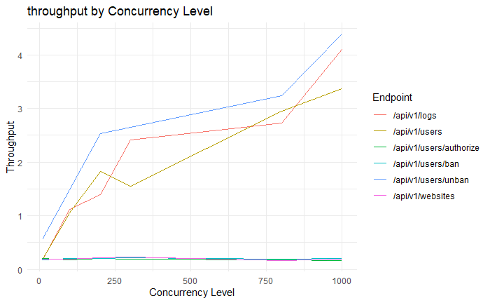
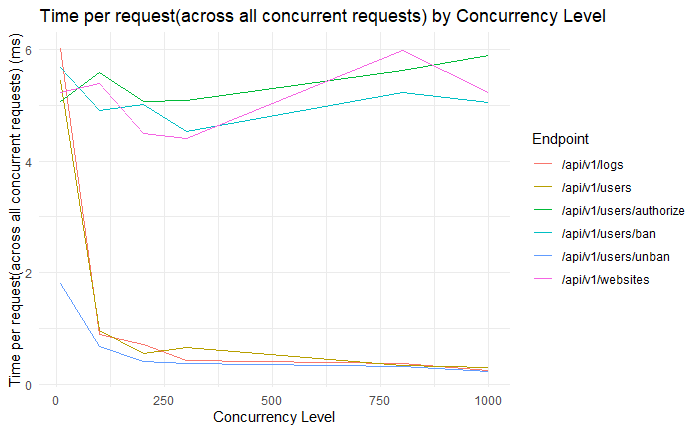

# Lab7-Report

## Introduction

The SSO (Single Sign-On) project encompasses interfaces for both user and administrator access to the backend. The
performance testing report presented here focuses on the user's perspective. It aims to evaluate the backend software in
terms of **concurrent user load**, **response times**, **system throughput**, **resource utilization**, and includes
part of **stress testing**. Please note that the performance of the `ManagementController`, which pertains to the
administrator interface, has been previously tested and documented in [Lab4-Conclusion](./Lab4-Conclusions.md).


## Database model

### Tables

1. logs - stores the logs of the user
2. users - stores the user information
3. websites - stores the website information of the user
4. usergroups - the group of user
5. usergroup_user - the relationship between user and usergroup
6. login_history - the login history of the user

### ER Diagram

<div align="center">

</div>
<div align="center">Figure 1. ERD of database</div>

### Database chosen

We use `h2` database instead of `derby`. H2 and Derby are both popular relational database management systems that are
often used for development purposes.

1. **In-Memory Databases:** Both H2 and Derby support in-memory databases, allowing you to create and operate on a
   database entirely in memory. This feature is useful for fast and lightweight development and testing scenarios.
2. **Database Reset:** Both H2 and Derby provide options to reset the database state each time the application starts.
   This is typically achieved by using the "create-drop" mode in the database configuration. In this mode, the database
   schema is created when the application starts, and it is dropped and recreated each time the application stops. This
   ensures a clean and consistent database state for development and testing purposes. 【In our case, we set it
   as `update` in the current state, because we have 3 million data in table `logs` which is used for test. We don't want to recreate them everytime we reboot.】
3. **Database Migration:** H2 and Derby support various mechanisms for database schema migration and versioning. These mechanisms can
   provide tools or libraries that allow you to manage database schema changes over time, such as adding new tables or
   modifying existing ones. This facilitates the evolution of the database schema during the development process.
4. **Data Persistence:** Both H2 and Derby allow you to persist data to disk, providing durability and data integrity.
   This enables you to store and retrieve data across application restarts, making them suitable for more persistent
   storage needs in development environments.
5. **Compatibility:** H2 and Derby are compatible with the SQL standard and offer similar SQL syntax and capabilities.
   This allows developers to write SQL queries and statements that work in both databases, making it easier to switch
   between them if needed.
6. **JDBC Support:** H2 and Derby both provide JDBC (Java Database Connectivity) drivers, which are widely used for
   connecting Java applications to databases. This means that you can use standard JDBC APIs to interact with the
   databases, making them compatible with a wide range of Java frameworks and libraries.

### JPA repository connects/interacts with database

1. **Configuration:**

```properties
# persistence in the ./db folder
spring.datasource.url=jdbc:h2:file:./db/lsea
# use h2 database
spring.datasource.driverClassName=org.h2.Driver
# use admin as username and password
spring.datasource.username=admin
spring.datasource.password=admin
# use hibernate dialect
spring.jpa.database-platform=org.hibernate.dialect.H2Dialect
# generate ddl
spring.jpa.generate-ddl=true
# When a new field is added to a java entity class, when the application is re-run, the field will be added to the new column in the database table, but the pre-existing column or constraint will not be removed
spring.jpa.hibernate.ddl-auto=update
# disable open-in-view
spring.jpa.open-in-view=false
# enable h2 console (http:ip:port/h2-console)
spring.h2.console.enabled=true
```

2. **Entity Mapping:**

   JPA repositories use entity classes that represent the database tables or collections. These entities are typically
   annotated with JPA annotations, such as @Entity, @Table, and @Column, to define their mapping to the database schema.
   The mapping information allows JPA to automatically generate SQL statements and map the results to and from the
   entities.

3. **Repository Interfaces:**

   JPA repositories define interfaces that extend the JpaRepository interface or other related repository interfaces
   provided by Spring Data JPA. These interfaces define the contract for accessing and manipulating the entities in the
   database. By implementing these interfaces, Spring Data JPA automatically generates the necessary implementations at
   runtime.
    ```java
    @Repository
    public interface LogRepository extends JpaRepository<Log, UUID> {
      /**
       * Find all logs for a given user.
       *
       * @param pageable - the page
       * @return a list of logs for the user
       */
      @Query("SELECT l FROM Log l ORDER BY l.createdAt DESC")
      List<Log> findLogs(Pageable pageable);

      /**
       * Find all logs for a given user that were created after a given timestamp.
       *
       * @param timestamp - the timestamp
       * @return a list of logs for the user
       */
      @Query("SELECT l FROM Log l WHERE l.createdAt > ?1 ORDER BY l.createdAt DESC")
      List<Log> findLiveLogs(Timestamp timestamp);
    }
    ```

4. **EntityManagerFactory and EntityManager:**

   JPA repositories use the `EntityManagerFactory`, which is responsible for creating and managing EntityManager
   instances. The `EntityManager` is the central interface for performing CRUD (Create, Read, Update, Delete) operations
   in JPA.

   We here not use them directly, but use `JpaRepository` instead. For example, The `save()` method provided by
   the `JpaRepository` interface abstracts away the underlying details of the `EntityManager` and provides a convenient
   way to persist entities to the database. When we invoke the `save()` method on a JpaRepository instance, behind the
   scenes, the EntityManager is utilized to perform the actual persistence operation. The EntityManager manages the
   persistence context and interacts with the underlying database.
   

## Performance testing

### Target
Conduct backend performance testing by performing load tests to obtain data on 
concurrent user counts, response times, system throughput, resource utilization 
(including CPU usage, memory usage, disk I/O, network I/O), and other metrics. 
We hope, through data analysis, to examine the limits in specific server environments 
and provided recommendations for software optimization.

### Preparation

1. Environment:
    - OS: Linux 5.4.0-1106-azure #112~18.04.1-Ubuntu
    - CPU: 4 cores
    - RAM: 8GB
    - Disk: 32GB
2. Monitoring System:
    - Springboot:
      - Actuator: Open endpoint `/actuator/prometheus` to get metrics data 
      - Prometheus (MicroMeter): Collect metrics data to `/actuator/prometheus`
    - Servers:
      - Prometheus: Collect metrics data from `/actuator/prometheus` and present them
        in a web UI default at `http://ip:9090`. In `/graph` page, we can get visualized data by query. 
      - Grafana: Distributed monitoring system, visualize metrics data from Prometheus server.
        In Grafana, we can create dashboard to show metrics data in a more intuitive way. Also we can set alert rules or
        ask Grafana to send report to us.
   
3. Server conditions before start test environment:
```
top - 20:58:21 up  1:04,  0 users,  load average: 0.09, 0.16, 0.17
Tasks:  22 total,   3 running,  19 sleeping,   0 stopped,   0 zombie
%Cpu(s):  0.0 us,  8.2 sy,  0.0 ni, 91.8 id,  0.0 wa,  0.0 hi,  0.0 si,  0.0 st
MiB Mem :   7957.7 total,   6266.6 free,   1123.6 used,    567.5 buff/cache
MiB Swap:      0.0 total,      0.0 free,      0.0 used.   6575.7 avail Mem
```

4. Testing tool: Apache Bench (ab)
   
   In [an article of Tencent](https://cloud.tencent.com/developer/article/1066196), during their load testing by `wrk`
   , `http_load` and `apache bench`, based on recording the backend logs, they found that the error margin of the number of
   requests in Apache Bench (ab) was around 0.2%. However, for the other two tools, the error margin was around 0.5%.
   So we choose `apache bench` to do the performance testing.

### Apache Bench Testing result

| Endpoint         | Path       | Method | Concurrency Level | Time taken for tests (s) | Complete requests | Total transferred (bytes) | Requests per second(RPS) | Time per request (ms) (mean) | Time per request (ms) (mean, across all concurrent requests) | Transfer rate (Kbytes/sec) |
| ---------------- | ---------- | ------ | ----------------- | ------------------------ | ----------------- | ------------------------- | ------------------------ | ---------------------------- | ------------------------------------------------------------ | -------------------------- |
| /api/v1/logs     | /          | POST   | 10                | 0.602                    | 100               | 16100                     | 166.22                   | 60.160                       | 6.016                                                        | 26.13                      |
| /api/v1/users    | /          | POST   | 10                | 0.545                    | 100               | 19550                     | 183.37                   | 54.535                       | 5.453                                                        | 35.01                      |
| /api/v1/users    | /authorize | POST   | 10                | 0.508                    | 100               | 16800                     | 196.92                   | 50.781                       | 5.078                                                        | 32.31                      |
| /api/v1/users    | /ban       | POST   | 10                | 0.569                    | 100               | 16800                     | 175.85                   | 56.865                       | 5.687                                                        | 28.85                      |
| /api/v1/users    | /unban     | POST   | 10                | 0.181                    | 100               | 16100                     | 553.11                   | 18.080                       | 1.808                                                        | 86.96                      |
| /api/v1/websites | /          | POST   | 10                | 0.522                    | 100               | 16800                     | 191.47                   | 52.227                       | 5.223                                                        | 31.41                      |
| /api/v1/logs     | /          | POST   | 100               | 0.896                    | 1000              | 161000                    | 1115.84                  | 89.618                       | 0.896                                                        | 175.44                     |
| /api/v1/users    | /          | POST   | 100               | 0.952                    | 1000              | 196000                    | 1050.35                  | 95.206                       | 0.952                                                        | 201.04                     |
| /api/v1/users    | /authorize | POST   | 100               | 5.582                    | 1000              | 168000                    | 179.14                   | 558.238                      | 5.582                                                        | 29.39                      |
| /api/v1/users    | /ban       | POST   | 100               | 4.909                    | 1000              | 168000                    | 203.71                   | 490.896                      | 4.909                                                        | 33.42                      |
| /api/v1/users    | /unban     | POST   | 100               | 0.675                    | 1000              | 161000                    | 1480.94                  | 67.525                       | 0.675                                                        | 232.84                     |
| /api/v1/websites | /          | POST   | 100               | 5.390                    | 1000              | 168000                    | 185.54                   | 538.973                      | 5.390                                                        | 30.44                      |
| /api/v1/logs     | /          | POST   | 200               | 0.716                    | 1000              | 161000                    | 1395.76                  | 143.291                      | 0.716                                                        | 219.45                     |
| /api/v1/users    | /          | POST   | 200               | 0.546                    | 1000              | 196000                    | 1832.86                  | 109.119                      | 0.546                                                        | 350.82                     |
| /api/v1/users    | /authorize | POST   | 200               | 5.068                    | 1000              | 168000                    | 197.31                   | 1013.623                     | 5.068                                                        | 32.37                      |
| /api/v1/users    | /ban       | POST   | 200               | 5.024                    | 1000              | 168000                    | 199.06                   | 1004.728                     | 5.024                                                        | 32.66                      |
| /api/v1/users    | /unban     | POST   | 200               | 0.396                    | 1000              | 161000                    | 2527.83                  | 79.119                       | 0.396                                                        | 397.44                     |
| /api/v1/websites | /          | POST   | 200               | 4.500                    | 1000              | 168000                    | 222.21                   | 900.033                      | 4.500                                                        | 36.46                      |
| /api/v1/logs     | /          | POST   | 300               | 0.498                    | 1200              | 193200                    | 2412.00                  | 124.378                      | 0.415                                                        | 379.23                     |
| /api/v1/users    | /          | POST   | 300               | 0.776                    | 1200              | 235200                    | 1545.80                  | 194.074                      | 0.647                                                        | 295.88                     |
| /api/v1/users    | /authorize | POST   | 300               | 6.107                    | 1200              | 201600                    | 196.50                   | 1526.755                     | 5.089                                                        | 32.24                      |
| /api/v1/users    | /ban       | POST   | 300               | 5.434                    | 1200              | 201600                    | 220.85                   | 1358.400                     | 4.528                                                        | 36.23                      |
| /api/v1/users    | /unban     | POST   | 300               | 0.453                    | 1200              | 193200                    | 2649.04                  | 113.249                      | 0.377                                                        | 416.50                     |
| /api/v1/websites | /          | POST   | 300               | 5.278                    | 1200              | 201600                    | 227.35                   | 1319.555                     | 4.399                                                        | 37.30                      |
| /api/v1/logs     | /          | POST   | 800               | 0.881                    | 2400              | 386400                    | 2723.54                  | 293.735                      | 0.367                                                        | 428.21                     |
| /api/v1/users    | /          | POST   | 800               | 0.813                    | 2400              | 470400                    | 2950.61                  | 271.130                      | 0.339                                                        | 564.77                     |
| /api/v1/users    | /authorize | POST   | 800               | 13.489                   | 2400              | 403200                    | 177.92                   | 4496.427                     | 5.621                                                        | 29.19                      |
| /api/v1/users    | /ban       | POST   | 800               | 12.548                   | 2400              | 403200                    | 191.27                   | 4182.584                     | 5.228                                                        | 31.38                      |
| /api/v1/users    | /unban     | POST   | 800               | 0.743                    | 2400              | 386400                    | 3231.25                  | 247.582                      | 0.309                                                        | 508.04                     |
| /api/v1/websites | /          | POST   | 800               | 14.373                   | 2400              | 403200                    | 166.97                   | 4791.138                     | 5.989                                                        | 27.39                      |
| /api/v1/logs     | /          | POST   | 1000              | 2.436                    | 10000             | 1610000                   | 4104.87                  | 243.613                      | 0.244                                                        | 645.39                     |
| /api/v1/users    | /          | POST   | 1000              | 2.966                    | 10000             | 1960000                   | 3371.69                  | 296.587                      | 0.297                                                        | 645.36                     |
| /api/v1/users    | /authorize | POST   | 1000              | 58.884                   | 10000             | 1680000                   | 169.83                   | 5888.406                     | 5.888                                                        | 27.86                      |
| /api/v1/users    | /ban       | POST   | 1000              | 50.587                   | 10000             | 1680000                   | 197.68                   | 5058.725                     | 5.059                                                        | 32.43                      |
| /api/v1/users    | /unban     | POST   | 1000              | 2.277                    | 10000             | 1610000                   | 4391.15                  | 227.731                      | 0.228                                                        | 690.40                     |
| /api/v1/websites | /          | POST   | 1000              | 52.230                   | 10000             | 1680000                   | 191.46                   | 5222.962                     | 5.223                                                        | 31.41                      |

### Analysis

#### 1. Time per request (ms)
**Formula:** Time per request=Time taken for tests/(Complete requests/Concurrency Level)

<div align="center">

</div>
<div align="center">Figure 2. Time per request By Concurrency level</div>

At lower concurrency levels (e.g., 10), the time per request is relatively lower compared to higher concurrency levels. This is because the server can handle a smaller number of concurrent requests more efficiently, resulting in faster response times.

As the concurrency level increases (e.g., 100, 200, 300), the time per request also tends to increase. This is because the server is now dealing with a larger number of concurrent requests, which can lead to resource contention and increased processing time for each request. The server may need to allocate more resources and manage thread synchronization, which can introduce overhead and impact the overall response time.

At very high concurrency levels (e.g., 800, 1000), the time per request may exhibit some fluctuations. This is often due to the server reaching its maximum capacity and becoming overloaded. The server may struggle to handle the increasing number of concurrent requests, resulting in varying response times.

#### 2. Throughput (req/sec)
**Formula:** Throughput = Complete requests/Time taken for tests

Time per request=Time taken for tests/(Complete requests/Concurrency Level)
<div align="center">

</div>
<div align="center">Figure 3. Throughput By Concurrency level</div>

It's clear that the throughput increases as the concurrency level increases. This is because the server can handle a larger number of concurrent requests more efficiently, resulting in faster response times.

In the plot, the throughput of `/api/v1/users/authorize`, `/api/v1/users/ban`, `/api/v1/websites` is not clear. And theoretically, the throughput should decrease after the concurrency increasing to so high value.

So we can analyze from the other side.

Due to:

Time per request:across all concurrent requests = Time taken for tests/testsComplete requests

i.e.:

Throughput = 1 / Time per request (ms) (across all concurrent requests)

Therefore, we can also see the throughput from : Time per request (across all concurrent requests)
<div align="center">

</div>
<div align="center">Figure 4. Time per request across all concurrent requests By Concurrency level.png By Concurrency level</div>

From the line of `websites` and `authorize`, time per request across all concurrent requests start increase when concurrency is 300, which means the throughput of this two endpoints start to decrease.

### Resource of the JVM and server
<div align="center">

</div>
<div align="center">Figure 5. IO Overview and JVM Memory during Apache Bench test</div>

<div align="center">

</div>
<div align="center">Figure 6. JVM Misc during Apache Bench test</div>

Note: For more details of resource situation see [Grafana Report](./Lab7/grafana-test.pdf)

From IO overview in figure 5, we can see 6 peek which are responsible for each ab test.

From the JVM Misc in figure 6, we can find the max CPU usage is 83%. And when check by `top`, the CPU usage is 230% (We have 4 core). Therefore, although we haven't fully used all resource, it's not low.

From the Thread panel in figure 6, we can see the max number of threads is 216. However, we can also find it creates new threads each time. But maximum of threads is stable in 216 since the concurrency level of request comes to 100.

For the JVM Memory part in the figure 5, we can see the memory use has large gap between maximum value and used which means we handle the data read not bad. 
Comparing to [Report of Lab4](./Lab4-Conclusions.md), which memory using limit the performance of the `management` endpoints, we should improve the algorithm in `management` point then can try new loading test.

#### Conclusion

Speed:
1. At lower concurrency levels (e.g., 10), the system demonstrates relatively fast response times, with time per request ranging from 18.080 ms to 60.160 ms.
2. As the concurrency level increases (e.g., 100, 200, 300), the response times tend to increase, indicating a decrease in overall system speed. The time per request ranges can reach to 1526.755 ms at these concurrency levels.
3. At extremely high concurrency levels (e.g., 800, 1000), the response times can further increase, reaching up to 5888.406 ms. This suggests that the system starts to experience significant performance limitations when dealing with a large number of concurrent requests.

Limitations:
1. The system's performance appears to have limitations when handling higher concurrency levels. As the number of concurrent requests increases, the system may struggle to efficiently process and respond to each request within an acceptable time frame.
2. Fluctuations in response times at extreme concurrency levels (800, 1000) indicate that the system may be reaching its maximum capacity and facing resource constraints or contention issues.
3 The average response times per request at higher concurrency levels (1000) are considerably higher compared to lower concurrency levels, indicating a potential bottleneck or saturation point in the system's performance.
   
Solution generated:
1. Set up timeout limitation for request: For now, we didn't set up the timeout request, so each request will sit in the waiting list. However, from the time per request, it is obviously not a good experience to wait for more than 5 seconds for some simple task.
2. Caching some results and check status of data in database: In `ban` endpoint, it will go through all algorithm of `ban()` even this user had been banned.
3. Configure max request at the same time and set thread pool: During the test, it creates new threads each time while not all concurrency level will go to the maximum. Before deploying, we can set a maximum of request to handle at the same time and give a suitable size of thread pool based on the server of deploying will use.