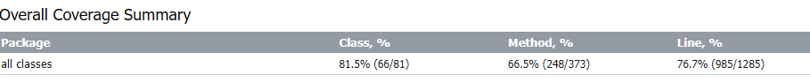
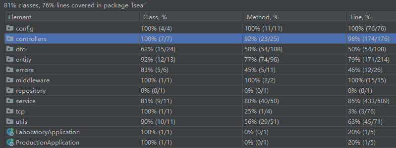
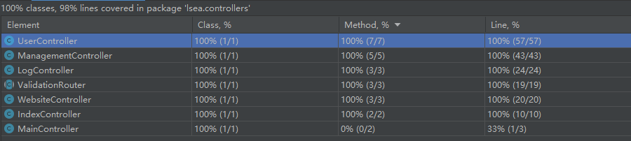

# Lab9-Report

## Tests List

1. Our CI/CD pipeline includes various testing techniques: unit tests, integration smoke tests and documentation javadoc tests.
```yml
run-unit-tests:
    stage: test
    script:
        - "mvn $MAVEN_CLI_OPTS -Dmaven.main.skip=true -Dtest=!lsea/controllers/* test -DfailIfNoTests=false"
    needs:
        - validate-project

run-api-tests:
    stage: test
    script:
        - "mvn $MAVEN_CLI_OPTS -Dmaven.main.skip=true -Dtest=lsea/controllers/* test"
    needs:
        - validate-project

test-javadoc:
    stage: test
    script:
        - mvn javadoc:javadoc
        - test -d target/site/apidocs/
    needs:
        - validate-project
```

2. Our test suites covers various scenarios, including:
    1. Non-trivial business logic tests
    2. No cookie (Controller)
    3. No content (Controller)
    4. Invalid token (Controller)
    5. Different special cases if exist
    
3. Our test should cover all business logic code, including:
    1. Integration tests of all endpoints of controller
    2. Unit tests of all Entity's methods which are used in business logic.

### Controller tests
| Business Logic | Test Name | Test Result | Test Description |
| -------------- | --------- | ----------- | ---------------- |
| Index Controller| sanityCheck | 200 | This test only have this response, which response to check the sanity. |
| Log Controller - CreateOne | testCreateOne | 200 | Successfully create a log. |
| Log Controller - CreateOne | testCreateOneWithoutCookie | 403 "No cookies found" | Forbid when no cookie. |
| Log Controller - CreateOne | testCreateOneWithoutContent | 422 "Something went wrong" | UnprocessableEntity when no content. |
| Log Controller - CreateOne | testCreateOneWithInvalidToken | 403 "Invalid token" | Forbid when token is invalid. |
| Log Controller - GenerateData | testGenerateDataIsOK | 200 | Successfully generate data. |
| Log Controller - GenerateData | testGenerateDataNoContent() | 4422 "Something went wrong" | UnprocessableEntity when no content. |
| Log Controller - GenerateData | testGenerateDataNoCookie | 403 "No cookies found" | Forbid when no cookie. |
| Log Controller - GenerateData | testGenerateDataInvalidToken | 403 "Invalid token" | Forbid when token is invalid. |
| Management Controller - Analysis Longest Log | testAnalysisLongestIsOK | 200 | Successfully analysis longest log. |
| Management Controller - Analysis Longest Log | testAnalysisLongestNoContent | 422 "Something went wrong" | UnprocessableEntity when no content. |
| Management Controller - Analysis Longest Log | testAnalysisLongestNoCookie | 403 "No cookies found" | Forbid when no cookie. |
| Management Controller - Analysis Longest Log | testAnalysisLongestInvalidToken | 403 "Invalid token" | Forbid when token is invalid. |
| Management Controller - Analysis Shortest Log | testAnalysisShortestIsOK | 200 | Successfully analysis shortest log. |
| Management Controller - Analysis Shortest Log | testAnalysisShortestNoContent | 422 "Something went wrong" | UnprocessableEntity when no content. |
| Management Controller - Analysis Shortest Log | testAnalysisShortestNoCookie | 403 "No cookies found" | Forbid when no cookie. |
| Management Controller - Analysis Shortest Log | testAnalysisShortestInvalidToken | 403 "Invalid token" | Forbid when token is invalid. |
| Management Controller - Generate report | testGenerateReportIsOK | 200 + `xlsx` file| Successfully generate report. |
| Management Controller - Generate report | testGenerateReportNoToken | 403 "No token found in cookies" | Validation error when no token. |
| Management Controller - Test database | testDatabaseReport | 200 + keys of map exist | Successfully test database. |
| User Controller - ping pong | testPing | 200 |  This test only have this response, which is used for client to test if the server is alive. |
| User Controller - Create User | testCreateUserIsOK | 200 | Successfully create a user. |
| User Controller - Create User | testCreateUserNoContent | 422 "Something went wrong" | UnprocessableEntity when no content. |
| User Controller - Create User | testCreateUserWithInvalidEmail | 403 "`A validation error occured: email must match \"^[a-z0-9_.+-]+@[a-z0-9-]+\\.[a-z0-9-.]+$\"`" | Forbid when email is invalid. |
| User Controller - Create User | testAlreadyExistingUser | 409 "User with email `xxxxx` already exists." | Conflict when user already exists. |
| User Controller - Authorize User | testAuthorizeUser | 200 | Successfully authorize a user. |
| User Controller - Authorize User | testAuthorizeUserWithWrongEmailOrPassword | 403 "Invalid e-mail or password" | Forbid when email or password is wrong. |
| User Controller - Ban User | testBanUserAdminBan | 200 | Successfully ban a user. |
| User Controller - Ban User | testBanUserNotAdminBan | 403 | Forbid when user is not admin. |
| User Controller - Unban User | testUnbanAdminUnban | 200 | Successfully unban a user. |
| User Controller - Unban User | testUnbanNotAdminUnban | 403 | Forbid when user is not admin. |
| User Controller - Update User | testUpdateUserIsOK | 200 - check user updated | Successfully update a user. |
| User Controller - Update User | testUpdateUserInValidToken | 403 "Invalid token" | Forbid when token is invalid. |
| User Controller - Update User | testUpdateUserNoContent | 422 "Something went wrong" | UnprocessableEntity when no content. |
| User Controller - Update User | testUpdateUserNoCookie | 403 "No cookies found" | Forbid when no cookie. |
| Website Controller - Create one | testCreateOneIsOK | 200 | Successfully create a website. |
| Website Controller - Create one | testCreateOneNoContent | 422 "Something went wrong" | UnprocessableEntity when no content. |
| Website Controller - Create one | testCreateOneNoCookie | 403 "No cookies found" | Forbid when no cookie. |
| Website Controller - Create one | testCreateOneInvalidToken | 403 "Invalid token" | Forbid when token is invalid. |
| Website Controller - Delete one | testDeleteOneIsOK | 200 | Successfully delete a website. |
| Website Controller - Delete one | testDeleteOneNoCookie | 403 "No cookies found" | Forbid when no cookie. |
| Website Controller - Delete one | testDeleteOneInvalidToken | 403 "Invalid token" | Forbid when token is invalid. |
| Website Controller - Delete one | testDeleteOneNoWebsiteFound | 404 "Website not found for this user" | Not found when this user doesn't contains this website. |
| Website Controller - Delete one | testDeleteOneNotOwner | 403 "User has no permission to delete this website" | Forbid when this user is not the owner of this website. |

### Other Business Logic Unit Tests
| Business Logic | Test Name | Test Situation |
| -------------- | --------- | -------------- |
| Log - create log | testCreateLog | assertEquals(createLogDto.getData(), log.getData()); |
| Log - create log | testCreateLog | assertEquals(LogType.Success, log.getLogType()); |
| Log - create log | testCreateLog | assertEquals(user.getId(), log.getUserId()); |
| Log - create log | testCreateLog | assertNotNull(log.getCreatedAt()); |
| Log - create log | testCreateLog | assertEquals(user.toJson(), log.getUserCurrentState()); |
| Log - dto - create log | testCreateLogWithInvalidLogType | assertThrows |
| UserGroup - create user group | testCreateUserGroup | Assertions.assertNotNull(userGroup.getId()); |
| UserGroup - create user group | testCreateUserGroup | Assertions.assertEquals(dto.getName(), userGroup.getName()); |
| UserGroup - create user group | testCreateUserGroup | Assertions.assertEquals(dto.getDescription(), userGroup.getDescription()); |
| UserGroup - create user group | testCreateUserGroup | Assertions.assertEquals(GlobalPermissions.USER, userGroup.getGlobalPermission()); |
| UserGroup - create user group | testCreateUserGroup | Assertions.assertNotNull(userGroup.getCreatedAt()); |
| UserGroup - dto - create user group | testCreateUserGroupThrowsGenericForbiddenError() | assertThrows |
| UserGroup - To Json | testToJson | Not Null |
| UserGroupUser - Create | testCreate | Assertions.assertNotNull(userGroupUser); |
| UserGroupUser - Create | testCreate | Assertions.assertNotNull(userGroupUser.getId()); |
| UserGroupUser - Create | testCreate | Assertions.assertEquals(UUID.fromString(userGroupId), userGroupUser.getUserGroupId()); |
| UserGroupUser - Create | testCreate | Assertions.assertEquals(UUID.fromString(userId), userGroupUser.getUserId()); |
| UserGroupUser - Create | testCreate | Assertions.assertEquals(GroupPermissions.REGULAR, userGroupUser.getGroupPermission()); |
| UserGroupUser - dto - Create | testCreateWithInsufficientPermissions | assertThrows |
| UserGroupUser - dto - Create | testCreateWithSpectatorPermissions | assertThrows |
| User - Create | testCreate | Assertions.assertEquals(dto.getUsername(), createdUser.getUsername()); |
| User - Create | testCreate | Assertions.assertEquals(dto.getEmail(), createdUser.getEmail()); | 
| User - Create | testCreate | Assertions.assertNotEquals(dto.getPassword(), createdUser.getPassword()); |
| User - Ban | testBan | Assertions.assertNotNull(user.getBannedAt()); |
| User - Ban | testBan | Assertions.assertEquals(adminId, user.getBannedById()); |
| User - Ban | testBan | Assertions.assertEquals(banReason, user.getBanReason()); |
| User - UnBan | testUnBan | Assertions.assertNull(user.getBannedAt()); |
| User - UnBan | testUnBan | Assertions.assertNull(user.getBannedById()); |
| User - UnBan | testUnBan | Assertions.assertNull(user.getBanReason()); |
| User - isBanned | testIsBanned | Assertions.assertTrue(user.isBanned()); |
| User - Change Password | testChangePassword | assertThrows verifyPassword |
| User - Verify Password | testVerifyPassword | Assertions.assertDoesNotThrow(() -> user.verifyPassword(correctPassword)); | 
| User - Verify Password | testVerifyPassword | Assertions.assertThrows(GenericForbiddenError.class, () -> user.verifyPassword(incorrectPassword));|
| User - jwt token | testGetJwtToken | Assertions.assertNotNull(jwtToken); |
| User - jwt token | testVerifyToken | Assertions.assertEquals(user.getId(), userId); |
| User - jwt token | testVerifyToken | Assertions.assertThrows(GenericForbiddenError.class, () -> User.verifyToken("invalid_token")); |
| User - to json | testToJson | Assertions.assertNotNull(user.toJson()); |
| Website - Create | testCreateWebsite | assertNotNull(website.getId()); |
| Website - Create | testCreateWebsite | assertEquals(createWebsiteDto.getDisplayName(), website.getDisplayName()); |    
| Website - Create | testCreateWebsite | assertEquals(user, website.getUser()); |
| Website - Create | testCreateWebsite | assertNotNull(website.getCreatedAt()); |
| Website - Create | testCreateWebsite | assertEquals(createWebsiteDto.getRedirectUrl(), website.getRedirectUrl()); |
| Website - Create | testCreateWebsite | assertNotNull(website.getPrivateKey()); | 
| Website - Create | testCreateWebsite | assertFalse(website.getIsActive()); |
| Website - Create | testCreateWebsite | assertEquals(website.getCreatedAt(), website.getUpdatedAt()); |
| Website - deep clone | testDeepClone | assert for each field |

## Special statement

`Test should avoid loops instructions`. We have one places have loops, but it is used for deep clone test to check each needed field has been deeply cloned.
    
## Other notes

### Mock
We use `mock` when testing with business components. In controller, we use `MockMvc` to send requests to the endpoints, and for other business components we use `Mockito`.
   
Using mocks in Java testing is a common practice when testing business components, particularly in unit testing scenarios. A mock object is a simulated object that mimics the behavior of a real object, allowing to isolate the component under test and verify its interactions with dependencies.
    - Isolation
    - Control and Predictability
    - Speed and Efficiency
    - Reproducible Tests
    - Test Independence and Stability
    
### Arrange-Act-Assert
Tests follow `Arrange-Act-Assert` pattern which is commented as `// Arrange`, `// Act`, `// Assert` in the code.

### Example code:

Here is part of codes from `ManagementControllerTest.java`:

```java
@RunWith(SpringRunner.class)
@SpringBootTest(classes = {LaboratoryApplication.class}, webEnvironment = SpringBootTest.WebEnvironment.RANDOM_PORT)
@AutoConfigureMockMvc
@Transactional
public class ManagementControllerTest {

    /**
     * This is the MockMvc object that is used to send requests to the endpoints.
     */
    @Resource
    private MockMvc mockMvc;

    /**
     * This test method sends a Get request to the "/api/v1/management/analysis-longest-five"
     *
     * @throws Exception Exception of mockMvc.perform
     */
    @Test
    @DisplayName("Test of ManagementController")
    @Rollback
    public void testAnalysisLongestIsOK() throws Exception {
        // Arrange
        generateTestData();

        String userAuthRequest = "{\n" +
                "    \"password\": \"test_admin\",\n" +
                "    \"email\": \"test_admin@example.com\"\n" +
                "}";

        MvcResult result = mockMvc.perform(
                MockMvcRequestBuilders
                        .post("/api/v1/users/authorize")
                        .contentType("application/json;charset=UTF-8")
                        .content(userAuthRequest))
                .andReturn();

        Cookie cookie = result.getResponse().getCookie("token");

        MockHttpServletRequestBuilder requestBuilder = MockMvcRequestBuilders
                .get("/api/v1/management/analysis-longest-five")
                .param("numThreads", "5")
                .cookie(cookie)
                .contentType("application/json;charset=UTF-8");

        /* Requirement 9 */
        // isOK
        // Act
        mockMvc.perform(requestBuilder)
                // Assert
                .andExpect(MockMvcResultMatchers.status().isOk())
                .andExpect(MockMvcResultMatchers
                        .jsonPath("$.data[0].data")
                        .value("test data55555"))
                .andExpect(MockMvcResultMatchers
                        .jsonPath("$.data[4].data")
                        .value("test data999999999"))
                .andDo(MockMvcResultHandlers.print());

    }
}
```

**Notes:**
As you can see we are using both `@Transactional` and `@Rollback` annotations.

It is because in this test class, there are two tests which are `testAnalysisLongestIsOK` and `testAnalysisShortestIsOK`, they will share the same `mockMvc` bean instance. 
They can pass the test independently, but if we run them together in the `CI/CD`, the second test will fail because the data in the mock instance has been changed by the first test. 
So we need to rollback the data after each test. Or we can arrange the tests before running them in the other method.

## Test Coverage Report

<div align="center">

</div>
<div align="center">Fig. 1 - Overall Coverage Summary</div>

From figure 1, we can see the overall coverage of test is 61/81 in class metrics, 248/373 in method metrics, 985/1285 in line metrics.

<div align="center">

</div>
<div align="center">Fig. 2 - Overall Coverage Summary details</div>
As you can see, the tests coverage report doesn't show 100%, because we focus on unit testing business logic and the code uncovered by unit tests, is covered in our case by integration tests so summing up unit and integration smoke tests, we would have 100% coverage.

<div align="center">

</div>
<div align="center">Fig. 3 - Coverage Summary for Package: lsea.controllers</div>

From figure 3, we can see the overall coverage of test would be 100% except for one entity class file which is not used yet at all in the business logic, but would be required in future features. After adding business logic related to this class, we are going to add the tests for it. For now it's not possible to correctly instantiate that class, as it requires logic, that is not yet written.


## Appendix - Test Result From CI/CD

### run-api-tests
```bash
[INFO] 
[INFO] Results:
[INFO] 
[INFO] Tests run: 44, Failures: 0, Errors: 0, Skipped: 0
[INFO] 
[INFO] ------------------------------------------------------------------------
[INFO] BUILD SUCCESS
[INFO] ------------------------------------------------------------------------
[INFO] Total time:  01:14 min
[INFO] Finished at: 2023-06-09T14:34:13Z
[INFO] ------------------------------------------------------------------------
section_end:1686321253:step_script
section_start:1686321253:archive_cache
Saving cache for successful job
Creating cache VERY_COOL_KEY-7...
.m2/repository: found 5033 matching artifact files and directories 
Archive is up to date!                             
Created cache
section_end:1686321254:archive_cache
section_start:1686321254:cleanup_file_variables
Cleaning up project directory and file based variables
section_end:1686321255:cleanup_file_variables
Job succeeded
```

### run-unit-tests
```bash
[INFO] 
[INFO] Results:
[INFO] 
[INFO] Tests run: 21, Failures: 0, Errors: 0, Skipped: 0
[INFO] 
[INFO] ------------------------------------------------------------------------
[INFO] BUILD SUCCESS
[INFO] ------------------------------------------------------------------------
[INFO] Total time:  50.128 s
[INFO] Finished at: 2023-06-06T02:07:08Z
[INFO] ------------------------------------------------------------------------
section_end:1686017228:step_script
section_start:1686017228:archive_cache
Saving cache for successful job
Creating cache VERY_COOL_KEY-7...
.m2/repository: found 5033 matching artifact files and directories 
Archive is up to date!                             
Created cache
section_end:1686017229:archive_cache
section_start:1686017229:cleanup_file_variables
Cleaning up project directory and file based variables
section_end:1686017230:cleanup_file_variables
Job succeeded
```

### test-javadoc
```bash
[INFO] ------------------------------------------------------------------------
[INFO] BUILD SUCCESS
[INFO] ------------------------------------------------------------------------
[INFO] Total time:  17.058 s
[INFO] Finished at: 2023-06-04T13:34:04Z
[INFO] ------------------------------------------------------------------------
$ test -d target/site/apidocs/
Saving cache for successful job
00:01
Creating cache VERY_COOL_KEY-7...
.m2/repository: found 5033 matching artifact files and directories 
Archive is up to date!                             
Created cache
Cleaning up project directory and file based variables
00:01
Job succeeded
```